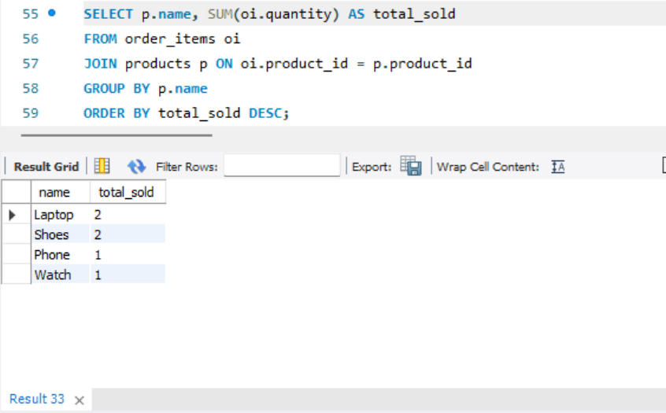
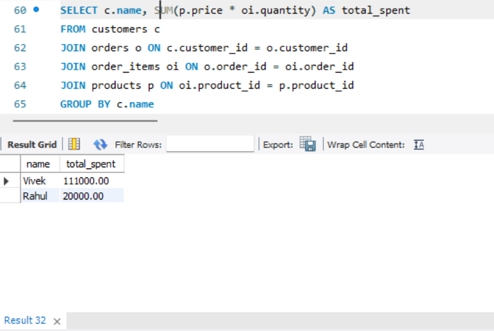
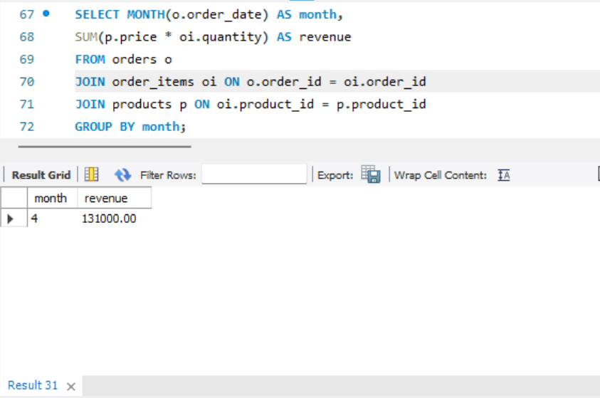
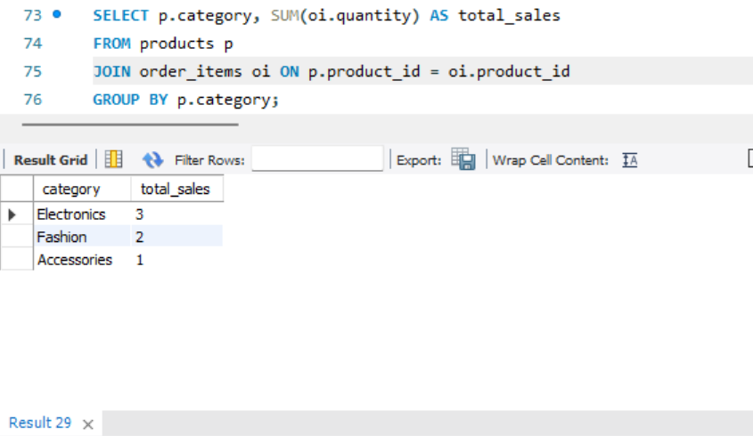
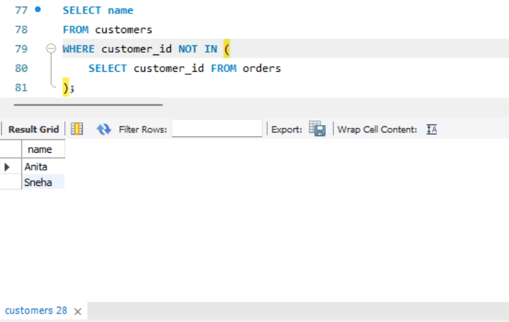
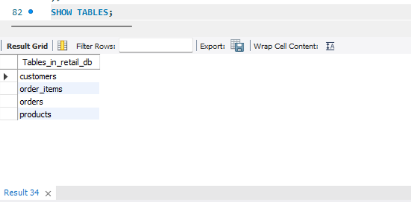
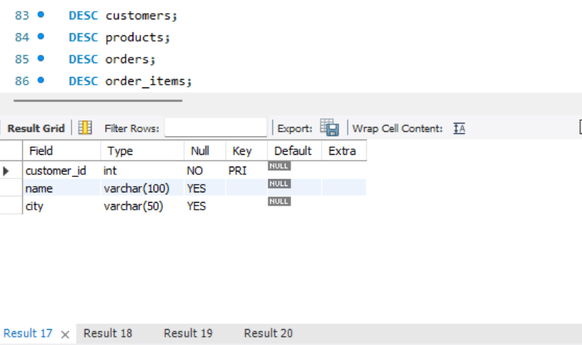
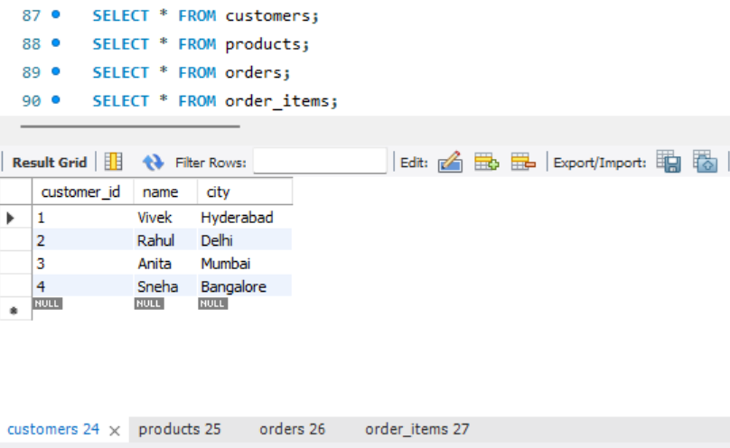

# sql-retail-sales-analysis
Online Retail Sales Analysis Database using SQL
# 🛒 Online Retail Sales Analysis Database

## 📌 Project Overview

This project focuses on designing a relational database for an online retail store and analyzing sales performance using SQL queries.

## 🎯 Objectives

* Create a relational database
* Store customer, product, and order data
* Extract meaningful insights using SQL queries

## 🧱 Database Tables

* Customers (customer_id, name, city)
* Products (product_id, name, category, price)
* Orders (order_id, customer_id, order_date)
* Order_Items (order_id, product_id, quantity)

## ⚙️ Key Features

* Structured database design
* Use of SQL JOIN operations
* Data analysis using aggregation functions

## 📊 SQL Queries Implemented

### 🔹 Top-Selling Products

### 🔹 Most Valuable Customers

### 🔹 Monthly Revenue

### 🔹 Category-wise Sales

### 🔹 Inactive Customers

## 📸 Database Screenshots

### 🔹 Tables Created

### 🔹 Table Structure

### 🔹 Data in Tables

## 🛠️ Tools Used

* MySQL Workbench
* SQL

## 🏆 Outcome

A structured database system that provides actionable business insights using SQL queries.
